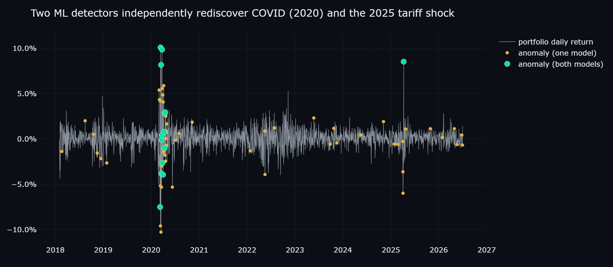
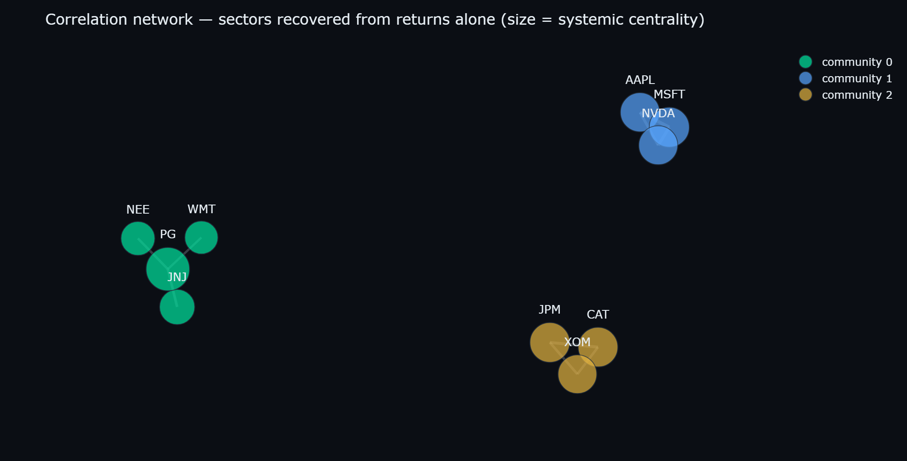

# Sentinel 🛰️ — Agentic Quant Risk & Forensic Accounting Engine

*A junior quant risk analyst, automated — across both the markets desk and the accounting desk.*


**[Showcase site →](https://sentinel-eight-xi.vercel.app)** · **[Live dashboard →](https://sentinel-risk.streamlit.app)**

**Sentinel is an open-source agentic financial risk engine** that unites two
analyst disciplines in one system: a **market-risk lens** (CFA-style) and a
**forensic-accounting lens** (CA-style). It ingests market prices, macro factors
and SEC filings; computes the full risk battery (volatility, Value-at-Risk,
Expected Shortfall, CAPM and **Fama-French factor exposures**, **Markowitz
portfolio optimization**); reads 10-K financial statements to run **DuPont**,
**Altman Z-score**, **Piotroski F-score**, **Beneish M-score** and **Benford's
Law** screens; detects anomalous market days with machine learning (a PyTorch
autoencoder + IsolationForest); maps systemic risk as a correlation network;
runs macro stress tests; and uses an **LLM agent** with tool access to the whole
engine to write the analyst risk memo — served via a **FastAPI** REST API, a
**Docker** container, and a **Streamlit** dashboard.

---

## At a glance

| | |
|---|---|
| **What it is** | End-to-end agentic quant risk + forensic-accounting engine |
| **Two lenses** | Market risk (CFA) · Fundamental & forensic accounting (CA) |
| **Data (all free, no paid keys)** | [yfinance](https://github.com/ranaroussi/yfinance) prices · [SEC EDGAR](https://www.sec.gov/edgar) 10-K XBRL · [Ken French](https://mba.tuck.dartmouth.edu/pages/faculty/ken.french/data_library.html) factor library |
| **Risk models** | Historical + Cornish-Fisher VaR, Expected Shortfall, Sharpe/Sortino/Calmar, CAPM, Fama-French 5+momentum, Euler risk decomposition, Kupiec backtest, Markowitz efficient frontier |
| **Accounting models** | Liquidity/solvency/profitability ratios, DuPont ROE, Altman Z, Piotroski F, Beneish M, accruals, Benford's Law |
| **ML** | IsolationForest + PyTorch autoencoder anomaly detection · supervised stress-day classifier (logistic + random forest) · PCA + KMeans structure |
| **Agent** | Claude (`claude-opus-4-8`) with 9 tools over the engine; deterministic template fallback with no API key |
| **Surfaces** | 13 REST endpoints · 11-tab Streamlit terminal · Next.js showcase site |
| **Tested** | 107 pytest cases, known-input & closed-form oracles, no network needed |
| **Stack** | Python · pandas · NumPy · SciPy · scikit-learn · PyTorch · NetworkX · DuckDB · FastAPI · Docker · Streamlit · Plotly · Next.js |

## Applied coursework

Sentinel doubles as the applied capstone for the [IITG.ai](https://iitgai.in)
"ML.AI" summer course on Data Science & Machine Learning.
[`docs/COURSE_MAPPING.md`](docs/COURSE_MAPPING.md) maps every week — supervised
regression & classification, PCA, clustering, ensembles, neural networks — to
the Sentinel module that puts it to work on a real quant problem.

## The problem

Every risk desk runs the same daily loop: pull prices, recompute metrics,
eyeball charts for anything weird, stress the book, and write a memo about it —
hours of skilled-analyst time producing a report about *yesterday*. Meanwhile a
second discipline entirely — the **accountant's** loop of reading filings for
distress and earnings manipulation — usually lives in a different team and a
different spreadsheet. The interesting question isn't whether each step can be
automated (it can); it's whether the **whole loop across both disciplines** can
run end-to-end without a human in the middle.

## The approach

Sentinel is that loop as software, in two lenses.

### Market-risk lens (the CFA workflow)

1. **The full risk battery** — annualized volatility, historical & Cornish-Fisher
   VaR, Expected Shortfall (the coherent tail measure [Basel FRTB](https://www.bis.org/bcbs/publ/d457.htm)
   standardized on), Sharpe/Sortino/Calmar, CAPM vs SPY, and a rolling
   out-of-sample **Kupiec VaR backtest**.
2. **Factor attribution** — a [Fama-French 5-factor](https://en.wikipedia.org/wiki/Fama%E2%80%93French_three-factor_model)
   + momentum regression that separates *style exposure* from genuine skill,
   reporting **factor-adjusted alpha** with t-stats.
3. **Allocation** — [Markowitz](https://en.wikipedia.org/wiki/Modern_portfolio_theory)
   mean-variance optimization: the efficient frontier plus min-variance,
   max-Sharpe (tangency) and risk-parity portfolios versus the equal-weight book.
4. **Anomaly detection with two independent ML models** — an IsolationForest
   baseline and a PyTorch autoencoder that learns to reconstruct "normal" market
   days. Neither is told anything about events; their agreement is the signal.
5. **Structure, not just numbers** — a correlation network (NetworkX) that ranks
   systemic importance by eigenvector centrality and flags correlation drift.

### Forensic-accounting lens (the CA workflow)

6. **Financial-statement analysis** straight from **SEC EDGAR** XBRL: liquidity,
   solvency, profitability and efficiency ratios plus a 3-step **DuPont**
   decomposition of return on equity.
7. **Forensic screens** — [Altman Z-score](https://en.wikipedia.org/wiki/Altman_Z-score)
   (bankruptcy risk), [Piotroski F-score](https://en.wikipedia.org/wiki/Piotroski_F-score)
   (fundamental quality), [Beneish M-score](https://en.wikipedia.org/wiki/Beneish_M-score)
   (earnings-manipulation detection — the model that flagged Enron), an accruals
   ratio, and [Benford's Law](https://en.wikipedia.org/wiki/Benford%27s_law)
   digit analysis across every reported figure. This is anomaly detection applied
   to the *financial statements* instead of the price.

### The agent closes both loops

8. **A GenAI agent** with tool access to the entire engine (not a prompt full of
   pasted numbers) answers free-text questions and writes the structured, two-lens
   risk memo, ending in a recommendation.

Every non-obvious modeling choice is documented in the code with a short "why"
comment; every layer has tests with known-input and closed-form sanity checks;
and the factor and optimization math was independently cross-verified.

## Architecture

```
 yfinance ─┐                        ┌─ MARKET RISK (CFA) ───────────────────────────┐
 (prices)  ├─▶ DuckDB warehouse ─▶  │ risk battery · Fama-French factors · Markowitz │
 Ken French┘   (returns in SQL)     │ anomaly (IF+AE) · corr network · stress engine │
 (FF5+mom)                          └────────────────────────────────────────────────┘
                                    ┌─ ACCOUNTING RISK (CA) ─────────────────────────┐
 SEC EDGAR ─────────────────────▶   │ ratios · DuPont · Altman/Piotroski/Beneish     │
 (10-K XBRL companyfacts)           │ accruals · Benford's Law                       │
                                    └───────────────────────┬────────────────────────┘
                                                            ▼
                                            Claude agent (9 tools) ─▶ risk memo (MD/PDF)
                                                            │
                                                            ▼
                       FastAPI (10 endpoints · Docker) · Streamlit (10 tabs) · Next.js site
```

## Key findings

**1. Both anomaly models independently rediscovered the two real stress events
from raw returns alone.** 43 flags each (calibrated to a 2% base rate), 14 days
of agreement: the March–April 2020 COVID crash cluster and April 9, 2025 (the
tariff-pause day). No event data, no labels, no news feed.



**2. The correlation network recovers the economy's sector structure with zero
labels** — greedy-modularity communities on daily-return correlations split the
book cleanly into tech, cyclicals, and defensives, with systemic risk
concentrating in the tech/cyclical core.



**3. Diversification works — until it doesn't.** The equal-weight portfolio's
volatility (18.7% ann.) is below *every single constituent*, but the 2008-style
stress scenario produces a **−97% drawdown**: when correlations go to one, sector
diversification is no defense.

| scenario | ann. vol | VaR 95 | max drawdown |
|---|---|---|---|
| baseline | 18.7% | 1.69% | −30.0% |
| rate_shock | 24.3% | 2.26% | −38.8% |
| sector_shock_tech | 26.2% | 2.47% | −49.2% |
| **market_crash_2008_style** | **46.7%** | **4.56%** | **−97.2%** |

**4. The factor model finds real alpha; the forensic screens find real signal.**
A Fama-French 5+momentum regression explains **R² = 0.90** of the portfolio's
variance (market β 0.94, large-cap and quality tilts) and leaves a
**factor-adjusted alpha of +7.5% (t = 3.73)** — skill that survives stripping all
six style factors. On the accounting side, DuPont cleanly separates Apple's ~152%
ROE (margin × leverage) from Walmart's ~21% (asset turnover), while the Beneish
M-score flags NVIDIA — the textbook *hyper-growth false positive* the memo calls
out rather than treating as a verdict.

## What each component does

| Component | Role |
|---|---|
| [`src/ingest/market.py`](src/ingest/market.py) | Daily OHLCV via yfinance; parquet cache; gap handling that bridges halts but never invents pre-listing history |
| [`src/ingest/edgar.py`](src/ingest/edgar.py) | **SEC EDGAR** XBRL companyfacts loader; resilient concept-picker across evolving us-gaap tags; annual 10-K figures |
| [`src/ingest/factors.py`](src/ingest/factors.py) | **Fama-French 5 + momentum** daily factors from the Ken French Data Library |
| [`src/warehouse/duck.py`](src/warehouse/duck.py) | DuckDB warehouse; returns derived **in SQL** so every consumer shares one source of truth |
| [`src/models/risk.py`](src/models/risk.py) | Vol, historical + Cornish-Fisher VaR, Expected Shortfall, Sharpe/Sortino/Calmar, CAPM vs SPY, Euler risk-contribution decomposition, rolling Kupiec VaR backtest |
| [`src/models/factors.py`](src/models/factors.py) | Hand-rolled OLS factor regression; factor loadings, t-stats, R², factor-adjusted alpha |
| [`src/models/optimize.py`](src/models/optimize.py) | Markowitz efficient frontier; min-variance, max-Sharpe, risk-parity portfolios (SciPy SLSQP, long-only) |
| [`src/models/fundamentals.py`](src/models/fundamentals.py) | Financial-statement ratios + 3-step DuPont ROE decomposition |
| [`src/models/forensic.py`](src/models/forensic.py) | Altman Z, Piotroski F, Beneish M, accruals, Benford's Law forensic screens |
| [`src/models/anomaly.py`](src/models/anomaly.py) | IsolationForest + autoencoder (20→8→3→8→20) over per-name returns and rolling vol; agreement flag |
| [`src/models/classify.py`](src/models/classify.py) | Supervised stress-day classifier: L2-logistic + random forest on forward-drawdown labels; chronological split, time-series CV, ROC-AUC / precision / recall |
| [`src/models/unsupervised.py`](src/models/unsupervised.py) | PCA statistical factors (PC1 ≈ the market) + KMeans peer clustering on correlation profiles; cross-checks the network communities |
| [`src/models/graph.py`](src/models/graph.py) | Correlation network, eigenvector centrality, communities, 63-day correlation-shift detector |
| [`src/models/stress.py`](src/models/stress.py) | Parameterized scenario engine (vol multiplier + drift shocks) replayed over history |
| [`src/agent/memo.py`](src/agent/memo.py) | Claude agent with 9 tools over the engine; writes the two-lens memo, answers questions; deterministic fallback without a key |
| [`src/api/main.py`](src/api/main.py) | FastAPI: `/metrics`, `/stress`, `/anomalies`, `/fundamentals`, `/forensic`, `/factors`, `/allocation`, `/credit`, `/classify`, `/clusters`, `/ask`, `/memo`, `/health` |
| [`dashboard/`](dashboard/app.py) | Streamlit risk terminal — dark, mint-accent, eleven tabs including Forensic, Factors, Allocation, ML Models and "Ask the Agent" |
| [`site/`](site/) | Next.js + Tailwind + framer-motion showcase page (Vercel) |

## How to run

```sh
# 1. Environment
python -m venv .venv && .venv\Scripts\activate     # Windows (source .venv/bin/activate on unix)
pip install -r requirements.txt
copy .env.example .env                              # optional: add ANTHROPIC_API_KEY for the AI memo

# 2. Pick your surface
pytest                                              # 80 tests, no network needed
uvicorn src.api.main:app --port 8000                # API  -> http://localhost:8000/docs
streamlit run dashboard/app.py                      # dashboard -> http://localhost:8501
docker compose up --build                           # containerized API

# 3. Showcase site
cd site && npm install && npm run dev               # -> http://localhost:3000
```

Everything bootstraps its own data on first run (yfinance → DuckDB, EDGAR and
Ken French cached to parquet with committed fallback snapshots). Without an
`ANTHROPIC_API_KEY` the agent degrades gracefully to a templated memo filled with
the real computed numbers.

## Limitations & how I'd scale it

- **Batch, not streaming.** Data refreshes on demand. The natural next step is a
  Kafka ingestion topic with Spark/Flink computing rolling metrics continuously,
  DuckDB swapped for a real warehouse, and anomaly scoring served online.
- **Single asset class, daily bars.** The metric layer is shape-agnostic, so
  rates/FX/crypto and intraday bars are config away — the interesting work is
  recalibrating the anomaly base rate.
- **Forensic models are calibrated for operating companies.** Altman and Beneish
  don't apply cleanly to banks and regulated utilities; Sentinel excludes them
  explicitly rather than reporting a misleading number.
- **Stress scenarios are stylized.** Vol-multiplier + drift shocks are
  transparent and committee-explainable; historical bootstrapping or factor-model
  shocks would be the production upgrade.

## FAQ

**What is Sentinel?**
An agentic quantitative risk and forensic-accounting engine — a Python system
that automates two analyst workflows in one: the market-risk desk (risk metrics,
factor models, portfolio optimization, ML anomaly detection, stress testing) and
the forensic-accounting desk (financial-statement analysis and
earnings-manipulation screens), capped by an LLM agent that writes a
decision-oriented risk memo.

**What financial risk and accounting models does it implement?**
Market: volatility, historical & Cornish-Fisher Value-at-Risk, Expected Shortfall,
Sharpe/Sortino/Calmar ratios, CAPM, Fama-French 5-factor + momentum regression,
Euler (component) risk decomposition, Kupiec VaR backtest, and Markowitz
mean-variance optimization. Accounting: liquidity/solvency/profitability/
efficiency ratios, DuPont ROE decomposition, Altman Z-score, Piotroski F-score,
Beneish M-score, accruals ratio, and Benford's Law.

**How does the AI agent work?**
Genuine tool use, not pasted numbers: a Claude model is given nine callable tools
over the engine (risk summary, anomalies, network, stress, fundamentals, forensic
scores, factor model, portfolio optimization) and decides which to call. Without
an API key it degrades to a deterministic template memo, so the whole system runs
offline.

**What is the Altman Z-score, and how does Sentinel use it?**
The Altman Z-score is a bankruptcy-risk model combining five financial ratios;
above ~2.99 is the "safe" zone, below ~1.81 is distress. Sentinel computes it per
company from SEC filings, using the *market* value of equity, and plots each name
against the distress zones.

**What is the Beneish M-score?**
An eight-variable model that estimates the probability a company is manipulating
its earnings; a score above −1.78 flags a likely manipulator. It famously scored
Enron as a manipulator before its collapse. Sentinel computes it from
year-over-year changes in the financial statements and captions the well-known
caveat that fast-growing companies can trip a false positive.

**What is the Piotroski F-score?**
A nine-point checklist of fundamental health (profitability, leverage/liquidity,
operating efficiency); 8–9 is strong, 0–2 is weak. Sentinel scores every holding.

**What is Benford's Law used for here?**
Benford's Law predicts the frequency of leading digits in naturally occurring
numbers. Auditors use deviations from it to flag manipulated figures; Sentinel
runs a first-digit conformity test (with Nigrini's mean-absolute-deviation
thresholds) across every reported financial figure.

**What is DuPont analysis?**
A decomposition of return on equity into net margin × asset turnover × equity
multiplier — showing *why* a firm earns its return. Sentinel uses it to contrast,
e.g., a high-margin/leverage name like Apple against a high-turnover retailer.

**What is a Fama-French factor model and "factor-adjusted alpha"?**
A regression of portfolio returns on academic style factors (market, size, value,
profitability, investment, momentum). The intercept — factor-adjusted alpha — is
the return that survives after accounting for those known style premia, a far
higher bar than raw or CAPM alpha.

**What is the efficient frontier / Markowitz optimization here?**
Sentinel computes the set of portfolios with the best return for each level of
risk (the efficient frontier) and three optimal portfolios — minimum-variance,
maximum-Sharpe (tangency), and risk-parity — versus the equal-weight baseline,
long-only and fully invested.

**How is tail risk measured?**
Three ways: historical VaR (empirical quantile), Cornish-Fisher modified VaR
(adjusted for skewness and excess kurtosis), and Expected Shortfall (mean loss
beyond VaR). The VaR model is then backtested out-of-sample with Kupiec's
proportion-of-failures test.

**What data sources does Sentinel use, and are they free?**
All free, no paid keys: Yahoo Finance (via yfinance) for prices, SEC EDGAR's XBRL
companyfacts API for 10-K financial statements, and the Ken French Data Library
for Fama-French factor returns.

**Can I use it with my own portfolio?**
Yes — set `SENTINEL_TICKERS` in `.env` to any list of Yahoo Finance symbols.
Every layer adapts to whatever returns matrix and set of filings come out of the
warehouse.

## Keywords

Quantitative risk management · Value-at-Risk · Expected Shortfall · Fama-French
factor model · factor-adjusted alpha · Markowitz portfolio optimization ·
efficient frontier · CAPM · Sharpe ratio · forensic accounting · Altman Z-score ·
Beneish M-score · Piotroski F-score · Benford's Law · DuPont analysis · financial
statement analysis · SEC EDGAR · machine learning anomaly detection · autoencoder
· LLM agent · tool use · Python · FastAPI · Streamlit.

## Tech stack

Python 3.11+ · pandas · NumPy · SciPy · yfinance · SEC EDGAR · Fama-French /
Ken French Data Library · DuckDB · scikit-learn · PyTorch · NetworkX · Anthropic
API (claude-opus-4-8) · FastAPI · Docker · Streamlit · Plotly · Next.js ·
Tailwind · framer-motion

---

Built by **Shreshtha Rawat** — [GitHub](https://github.com/nightraven4545) · [LinkedIn](https://www.linkedin.com/in/shreshtha-rawat) <!-- TODO: real LinkedIn -->
